# Water Level Indicator


A smart water level monitoring system for ESP32 with a modern web dashboard, real-time animated tank, persistent logging, and easy configuration.

---

## Features
- Real-time water level monitoring with animated tank visualization
- Responsive web dashboard (mobile & desktop)
- WiFi, MQTT, tank, sensor, display, network, alert, and device settings
- Persistent log file with download/view options
- Help page with wiring diagram and connection guide
- Factory reset, OTA update, and more

---

## Recent Improvements
- **Persistent configuration:** All settings (WiFi, MQTT, tank, sensor, display, network, alerts, device, etc.) are now saved to non-volatile storage and survive reboots.
- **Modular web UI:** All HTML, CSS, and JS are now served from LittleFS using templates, with consistent headers, footers, and navigation across all pages.
- **Live AJAX settings:** All settings forms (WiFi, MQTT, Tank, Sensor, Display, Network, Alerts, Device) use AJAX for live updates and inline feedback, without page reloads.
- **Display enhancements:** DisplayManager supports runtime selection of MAX7219 module type, brightness slider, and scrolling toggle. Display logic auto-scrolls long values and shows error states.
- **Improved tank setup:** Tank unit (cm/in) is remembered and values are converted accordingly. SVG tank on dashboard shows live value and error state if sensor is disconnected.
- **Robust logging:** Detailed logs for WiFi, sensor, MQTT, display, and more. Logs can be shown on the MAX7219 display as scrolling text (user-toggleable).
- **Bug and linter fixes:** Fixed multiple definition errors, string concatenation, Unicode/emoji issues, and modularized code for maintainability.
- **404 and error pages:** Custom not found and error pages with full HTML structure and navigation.

---

## Screenshots

| Dashboard | Logs | Help & Diagram |
|-----------|------|---------------|
| 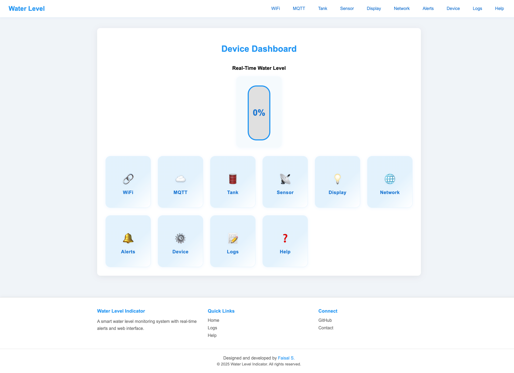 | 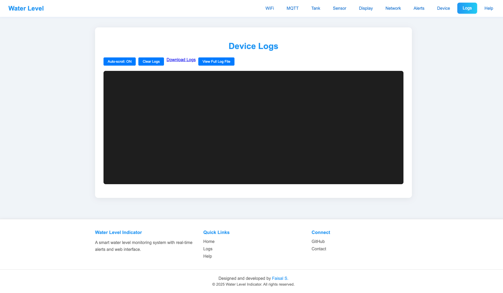 | 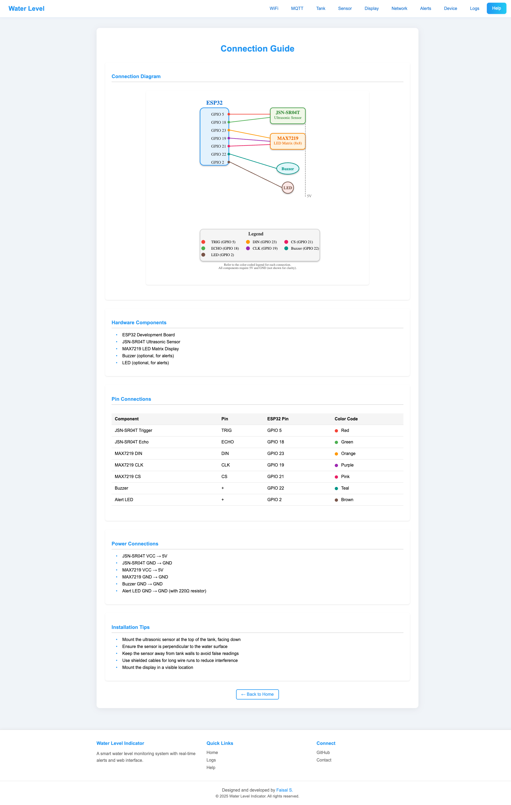 |

| WiFi | MQTT | Tank | Sensor |
|------|------|------|--------|
| 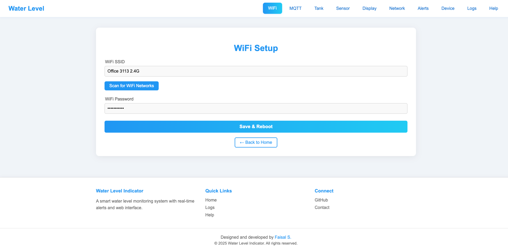 | 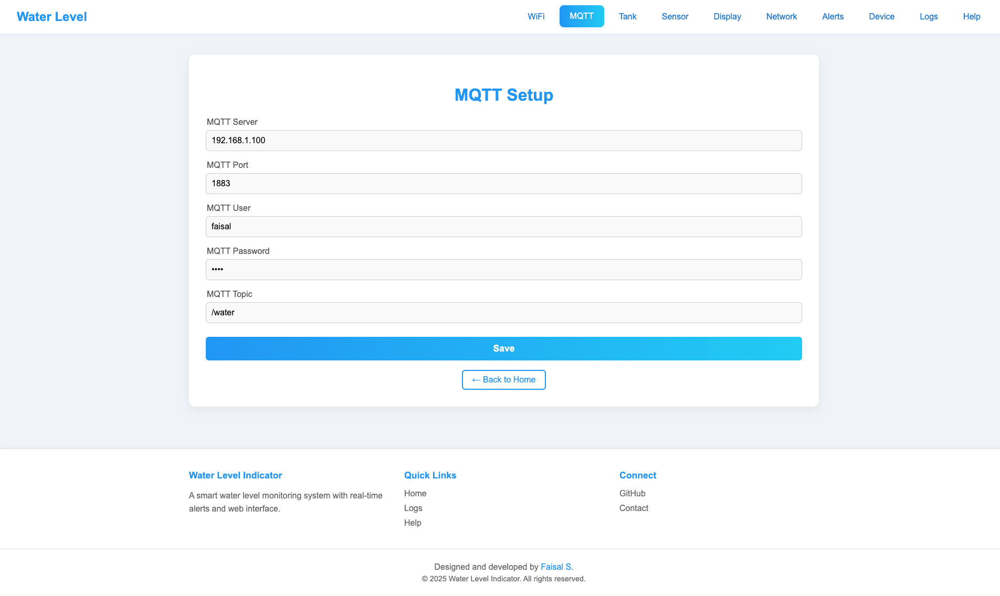 | 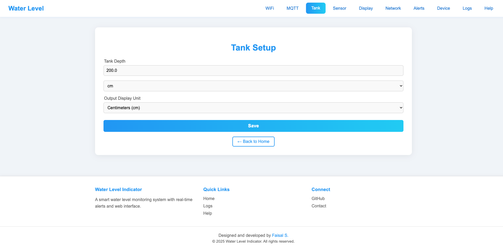 | 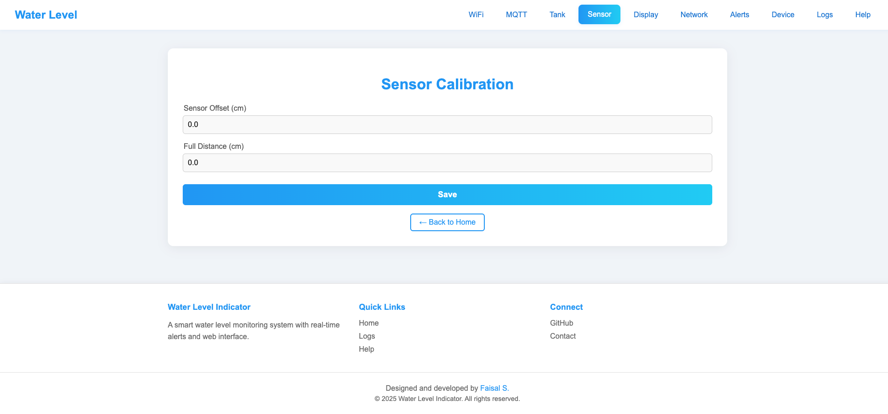 |

| Display | Network | Alerts | Device |
|---------|---------|--------|--------|
| 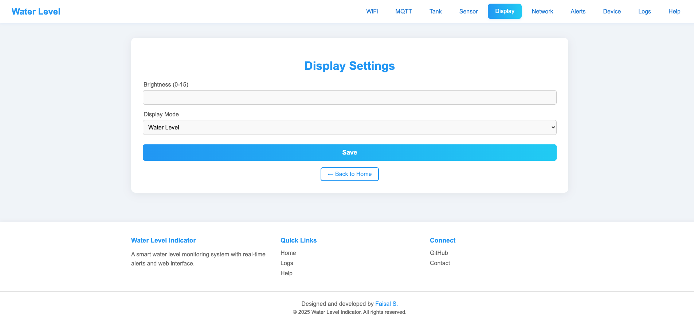 | 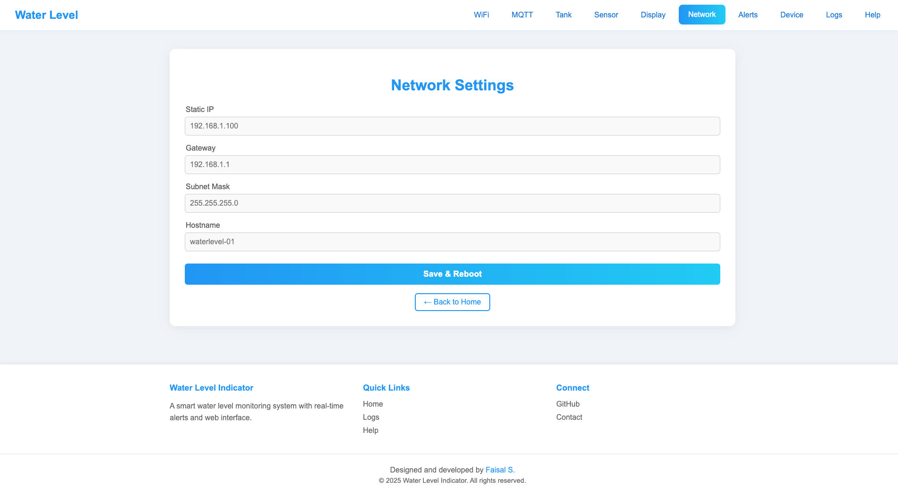 | 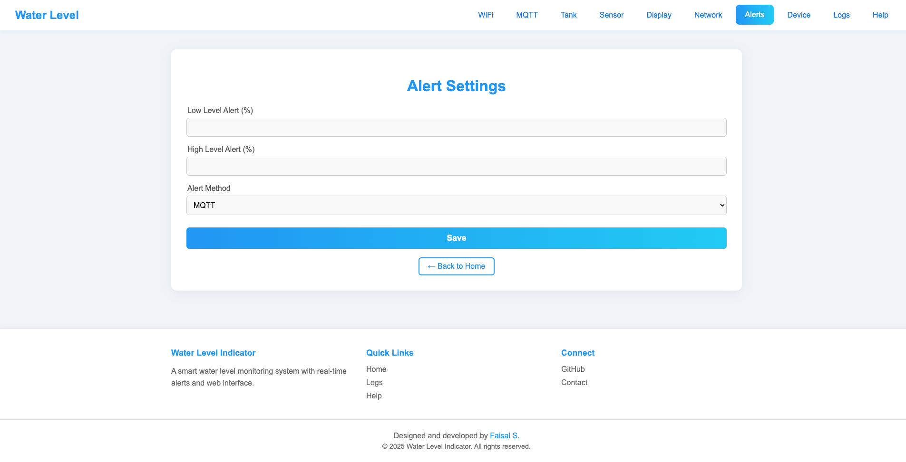 | 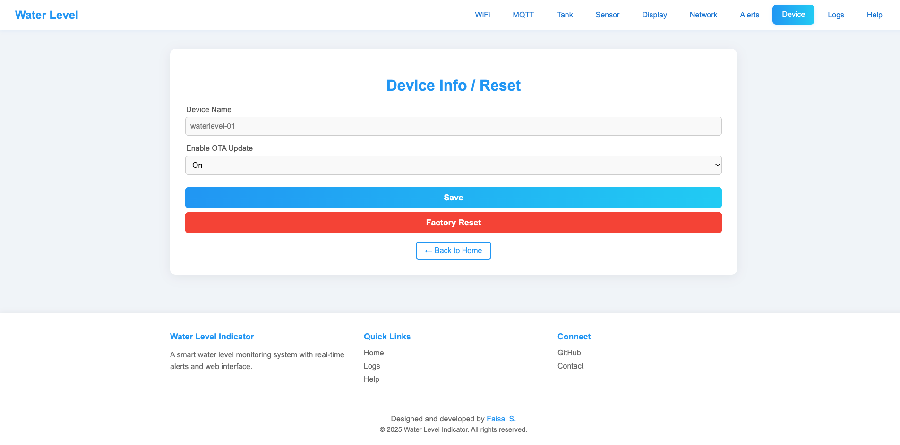 |

<!-- | Connected |
|-----------|
|  | -->

---

## Hardware Required
- ESP32 Development Board
- JSN-SR04T (or HC-SR04) Ultrasonic Sensor
- MAX7219 8x8 LED Matrix Display
- Buzzer (optional)
- LED (optional)
- Wires, breadboard, power supply

---

## Wiring Diagram


---

## Getting Started

### Prerequisites

- ESP32 development board and required hardware (JSN-SR04T/HC-SR04, MAX7219, etc.)
- [PlatformIO](https://platformio.org/) (install via VSCode extension or `pip install platformio`)
- Python 3.x
- USB cable for ESP32

### Steps

1. **Clone the repository**
   ```sh
   git clone https://github.com/vtoxi/waterlevel-esp32.git
   cd waterlevel-esp32
   ```

2. **(Optional) Create a Python virtual environment**
   ```sh
   python3 -m venv .venv
   source .venv/bin/activate  # On Windows: .venv\Scripts\activate
   # pip install -r requirements.txt  # If you have a requirements file
   ```

3. **Upload web files to ESP32 LittleFS**
   > This uploads your web assets (HTML, CSS, JS, SVG, etc.) to the ESP32's filesystem.
   ```sh
   python3 upload_files.py
   ```
   - Make sure your ESP32 is connected via USB and the correct port is set in `platformio.ini`.

4. **Build and upload the firmware**
   ```sh
   platformio run -t upload
   ```
   - This will compile and flash the main firmware to your ESP32.

5. **Open the serial monitor (optional, for debugging)**
   ```sh
   platformio device monitor
   ```
   - This will show logs and the device's IP address after connecting to WiFi.

6. **Connect to the device**
   - If the device is not yet configured, connect to its WiFi AP (SSID will be shown in the serial monitor).
   - Open a browser and go to the device's IP address (shown in the serial monitor or typically `192.168.4.1` for AP mode).

7. **Configure WiFi and other settings**
   - Use the web interface to set up WiFi, MQTT, tank, sensor, and other settings.
   - Only WiFi/Network changes require a reboot; all other settings apply instantly.

8. **Enjoy!**
   - View the real-time animated tank, logs, and all features from the web dashboard.

---

## Web Interface Features
- **Dashboard:** Animated tank, quick access widgets
- **Logs:** Real-time and persistent logs, download/view options
- **Settings:** WiFi, MQTT, tank, sensor, display, network, alerts, device
- **Help:** Connection guide, wiring diagram

---

## Configuration
- All settings are saved in non-volatile storage
- Only WiFi/Network changes require a reboot
- All other settings apply instantly

---

## Logging
- Logs are stored in `/logs.txt` on LittleFS
- View/download logs from the web interface
- Log rotation and clear options available

---

## Contributing
Pull requests and suggestions welcome! Please open an issue for major changes.

---

## License

This project is licensed under the MIT License. See [LICENSE](LICENSE) for details.

---

## Credits
- Developed by Faisal S. ([github.com/vtoxi](https://github.com/vtoxi))
- Powered by ESP32, PlatformIO, and open source libraries 